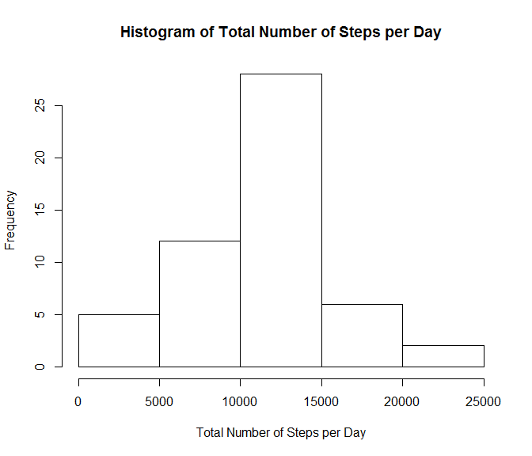
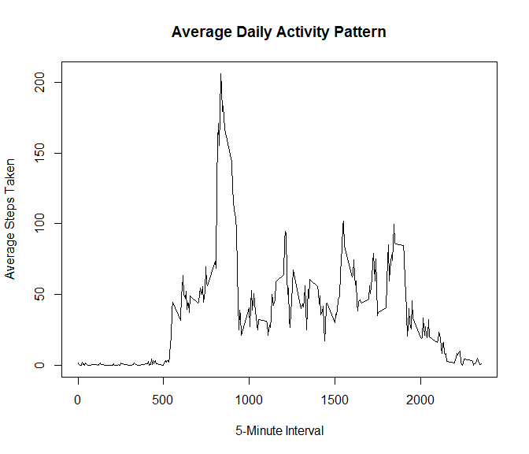
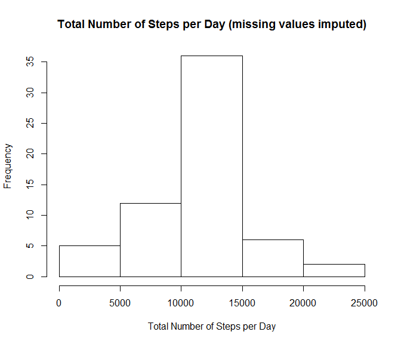
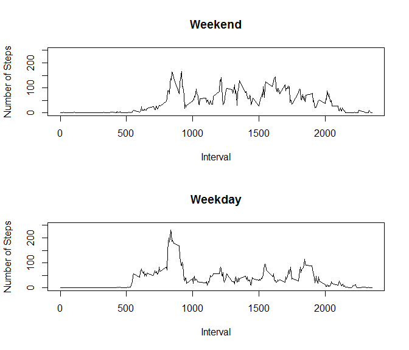

# Reproducible Research: Course Project 1


## Reading and Processing the Data

Below is my code for loading the Activity Monitoring Data and then creating a table to calculate the total steps per taken per day.


```r
activityData<-read.csv("activity.csv",header=TRUE)
activitySum<-tapply(activityData$steps,activityData$date,sum)
```

## Histogram of the Total Number of Steps Taken per Day

Here is the code to create a histogram of the total number of steps taken per day, as well as the actual histogram


```r
hist(activitySum, main="Histogram of Total Number of Steps per Day", xlab="Total Number of Steps per Day")
```




## Mean and Median Number of Steps Taken per Day

Here is the code to calculate the mean and median number of steps taken per day


```r
TotalMean<-mean(activityData$steps,na.rm=TRUE)
TotalMedian<-median(activityData$steps,na.rm=TRUE)
TotalMean
```

```
## [1] 37.3826
```

```r
TotalMedian
```

```
## [1] 0
```


## Average Daily Activity Pattern

The code below creates a time series plot of average daily activity


```r
intervalMean<-tapply(activityData$steps,activityData$interval,mean,na.rm=TRUE)
intervaldf<-add_rownames(as.data.frame(intervalMean),"VALUE")
colnames(intervaldf)<-c("5-Minute Interval","Average Steps Taken")

plot(intervaldf$`5-Minute Interval`,intervaldf$`Average Steps Taken`,type = "l",xlab="5-Minute Interval",ylab="Average Steps Taken",main="Average Daily Activity Pattern")
```




## Maximum Number of Steps

The code below determines which 5-minute interval has the maximum average number of steps


```r
colMax<-function(data) sapply(data, max, na.rm = TRUE)
intervalMax<-colMax(intervaldf)
intervalMax
```

```
##   5-Minute Interval Average Steps Taken 
##               "955"  "206.169811320755"
```


## Imputing Missing Values

The section deals with imputing missing values for the Activity Monitoring Dataset.

Here is the code to calculate the number of missing (NA) values that exist in the data

```r
sum(is.na(activityData$steps))
```

```
## [1] 2304
```


## Imputing Missing Values: Strategy and Execution

A strategy is needed for imputing the missing values in this dataset.  For simplicity, I will use the mean value for the 5-minute interval in which the missing value exists.

Here is the code for creating an updated version of the Activity Monitoring Dataset that has the missing values filled in.


```r
updatedDS<-activityData
for (i in 1:length(updatedDS$steps))
    {if(is.na(updatedDS$steps[[i]]))
      {updatedDS$steps[[i]]<-as.numeric(intervaldf[match(updatedDS$interval[[i]],intervaldf$`5-Minute Interval`),2])
      }
    }
```

Here is a Histogram showing the total number of steps per day (with the NA values replaced)

```r
imputedSum<-tapply(updatedDS$steps,updatedDS$date,sum)
hist(imputedSum, main="Total Number of Steps per Day (missing values imputed)", xlab="Total Number of Steps per Day")
```




Calculating mean and median total steps after the missing values are imputed

```r
imputedTotalMean<-mean(updatedDS$steps)
imputedTotalMedian<-median(updatedDS$steps)
imputedTotalMean
```

```
## [1] 37.3826
```

```r
imputedTotalMedian
```

```
## [1] 0
```

As you can see, the Mean and Median values remain the same, even after the missing values are imputed. The Mean values are the same since I used the 5-minute interval mean to impute the missing values.  The Median values are the same because there are so many zeroes in the dataset, that the middle number is still zero.


## Differences in Activity Patterns between Weekdays and Weekends

Here is the code for to plot the average number of steps taken per day and compare the values between weekdays and weekends


```r
updatedDS$DayType <- ifelse(is.weekend(updatedDS$date),"Weekend","Weekday")

##Calclulating average number of steps for Weekends
imputedWeekendMean<-tapply(updatedDS$steps[updatedDS$DayType=="Weekend"],updatedDS$interval[updatedDS$DayType=="Weekend"],mean,na.rm=TRUE)

##Calclulating average number of steps for Weekdays
imputedWeekdayMean<-tapply(updatedDS$steps[updatedDS$DayType=="Weekday"],updatedDS$interval[updatedDS$DayType=="Weekday"],mean,na.rm=TRUE)

imputedWeekenddf<-add_rownames(as.data.frame(imputedWeekendMean),"VALUE")
colnames(imputedWeekenddf)<-c("5-Minute Interval","Average Steps Taken")

imputedWeekdaydf<-add_rownames(as.data.frame(imputedWeekdayMean),"VALUE")
colnames(imputedWeekdaydf)<-c("5-Minute Interval","Average Steps Taken")

##Plotting graph comparing average steps for weekends and weekdays
par(mfrow=c(2,1))
plot(imputedWeekenddf$`5-Minute Interval`,imputedWeekenddf$`Average Steps Taken`,type = "l",xlab="Interval",ylab="Number of Steps",main="Weekend",ylim=c(0,250))
plot(imputedWeekdaydf$`5-Minute Interval`,imputedWeekdaydf$`Average Steps Taken`,type = "l",xlab="Interval",ylab="Number of Steps",main="Weekday",ylim=c(0,250))
```


